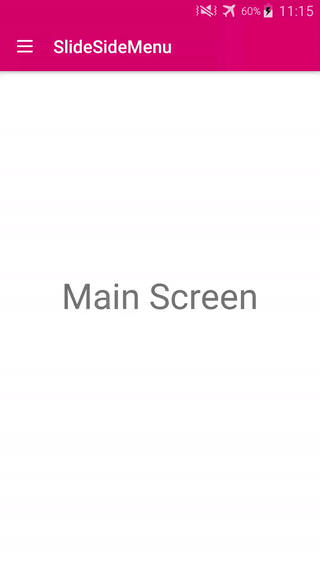

侧滑菜单，侧滑后主界面缩小

# clone from: https://github.com/lemonade-hq/SlideSideMenu.git
感谢作者分享，这里升级了AndroidX，Gradle 7.0.2，Java 11， 

#SlideSideMenu for Android

A layout widget for a sliding side menu.

##Features

 - Sleek slide menu animation 
 - Use in xml
 - Customize animation
 - Easy to use

##Demo



##Import

 ```xml
    Coming Soon... (Please clone for now)
 ```

##Usage

For basic usage, simply add to layout xml:

 ```xml
    <com.lemonade.widgets.slidesidemenu.SlideSideMenuTransitionLayout
        xmlns:android="http://schemas.android.com/apk/res/android"
        xmlns:tools="http://schemas.android.com/tools"
        android:id="@+id/slide_side_menu"
        android:layout_width="match_parent"
        android:layout_height="match_parent">

        <!-- Child #1 menu container -->
        <LinearLayout
            android:layout_width="match_parent"
            android:layout_height="match_parent"
            android:orientation="vertical">
            
        </LinearLayout>

        <!-- Child #2 content container -->
        <!-- Optinal: use SlideSideMenuContentCardView to enalbe shadow + round corners effect -->
        <com.lemonade.widgets.slidesidemenu.SlideSideMenuContentCardView
            android:layout_width="match_parent"
            android:layout_height="match_parent">
            <FrameLayout
                android:layout_width="match_parent"
                android:layout_height="match_parent"
                android:background="#ffffff">

            </FrameLayout>
        </com.lemonade.widgets.slidesidemenu.SlideSideMenuContentCardView>
    </com.lemonade.widgets.slidesidemenu.SlideSideMenuTransitionLayout>
 ```
